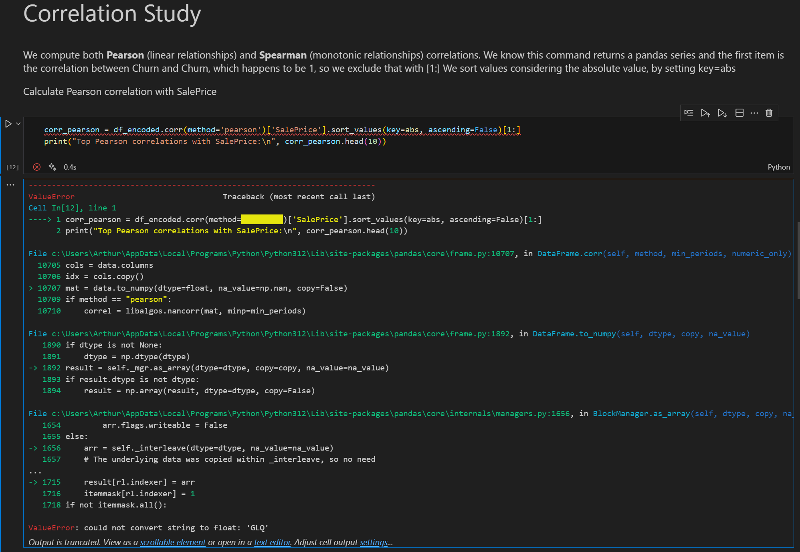
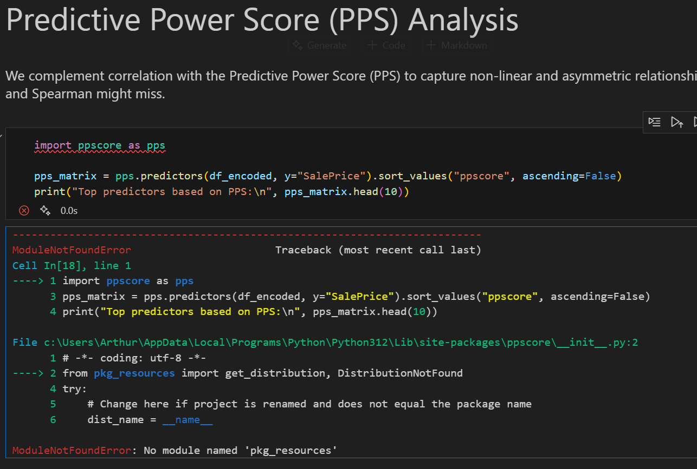
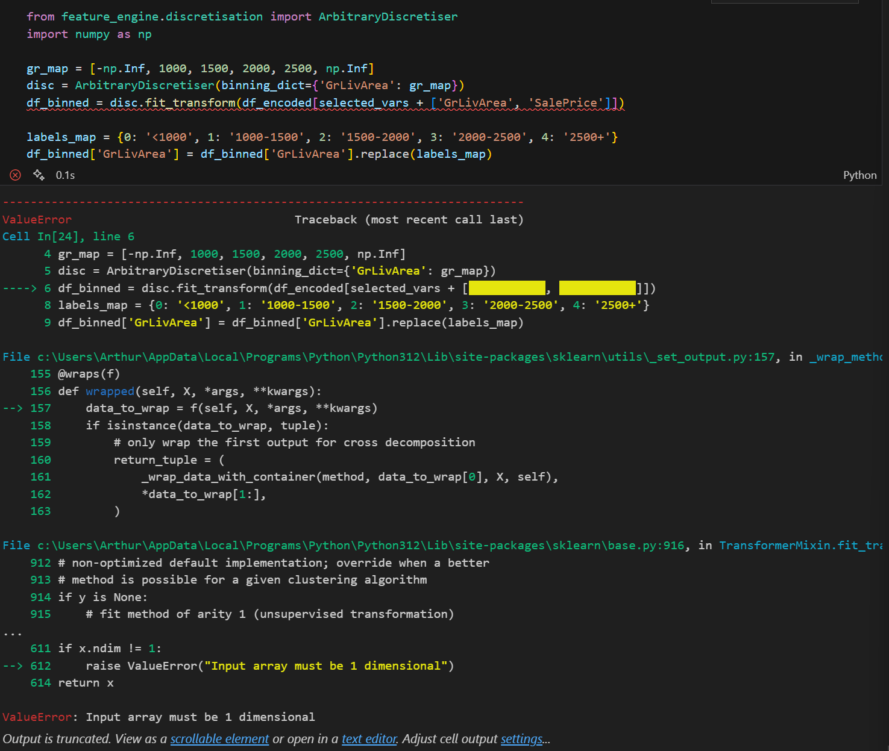
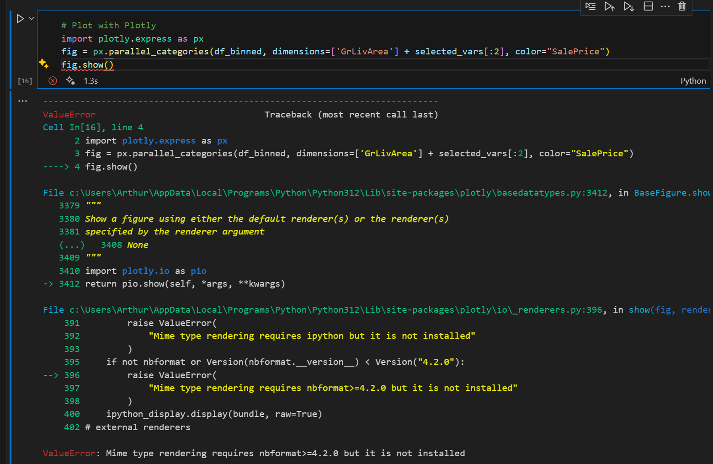
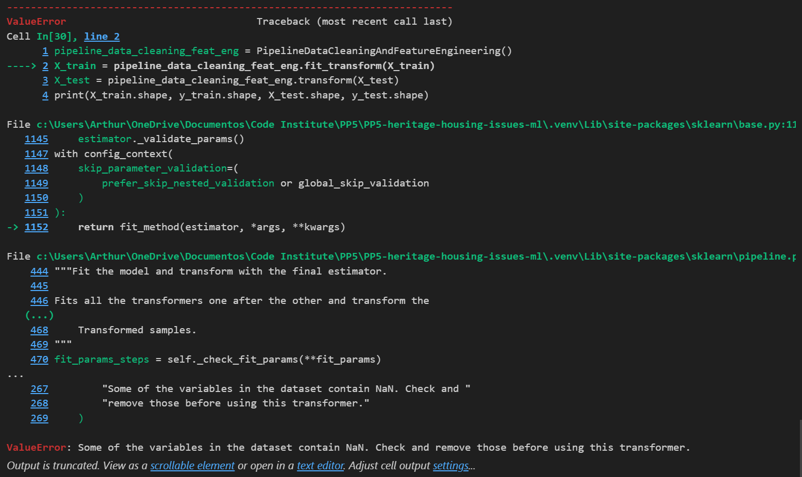

# Predictive Analytics Project – Heritage Housing Issues

Lydia Doe, a fictional individual, inherited four houses in Ames, Iowa. She needs help estimating their market value and understanding what features influence house prices in that region.

## Dataset Description

The dataset is sourced from [Kaggle](https://www.kaggle.com/codeinstitute/housing-prices-data) and contains historical housing data for properties in Ames, Iowa. We created a fictitious user story where predictive analytics can be applied in a real project scenario.

Each row in the dataset represents a single house sale transaction, and each column contains a specific attribute related to the house's physical characteristics, condition, or sale details.

The dataset includes information about:

- Property characteristics such as size of living area, number of bedrooms above ground, basement size, and garage area
- Condition and quality ratings such as overall material quality and kitchen quality
- Construction features such as year built, year remodeled, and presence of porches or decks
- Sale information such as the final selling price

| Variable          | Meaning                                          | Units/Values                                 |
|-------------------|--------------------------------------------------|----------------------------------------------|
| 1stFlrSF          | First floor square footage                       | Square feet (334–4692)                       |
| 2ndFlrSF          | Second floor square footage                      | Square feet (0–2065)                         |
| BedroomAbvGr      | Bedrooms above ground (not including basement)   | Integer (0–8)                                |
| BsmtExposure      | Exposure level of basement walls                 | Gd, Av, Mn, No, None                         |
| BsmtFinSF1        | Finished basement area (Type 1)                  | Square feet (0–5644)                         |
| BsmtUnfSF         | Unfinished basement area                         | Square feet (0–2336)                         |
| TotalBsmtSF       | Total basement area                              | Square feet (0–6110)                         |
| GarageArea        | Garage size                                      | Square feet (0–1418)                         |
| GarageFinish      | Garage interior finish                           | Fin, RFn, Unf, None                          |
| GarageYrBlt       | Year the garage was built                        | Year (1900–2010)                             |
| GrLivArea         | Above-grade living area                          | Square feet (334–5642)                       |
| KitchenQual       | Kitchen quality rating                           | Ex, Gd, TA, Fa, Po                           |
| LotArea           | Lot size                                         | Square feet (1300–215245)                    |
| LotFrontage       | Street frontage length                           | Feet (21–313)                                |
| MasVnrArea        | Masonry veneer area                              | Square feet (0–1600)                         |
| EnclosedPorch     | Enclosed porch area                              | Square feet (0–286)                          |
| OpenPorchSF       | Open porch area                                  | Square feet (0–547)                          |
| OverallCond       | Overall condition of the house                   | 1 (Very Poor) to 10 (Very Excellent)         |
| OverallQual       | Overall material and finish quality              | 1 (Very Poor) to 10 (Very Excellent)         |
| WoodDeckSF        | Wood deck area                                   | Square feet (0–736)                          |
| YearBuilt         | Year the house was originally built              | Year (1872–2010)                             |
| YearRemodAdd      | Year the house was last remodeled                | Year (1950–2010)                             |
| SalePrice         | Final sale price of the property                 | USD (34900–755000)                           |

This dataset provides sufficient structure and detail to build a machine learning model capable of predicting sale prices and to visualize how different attributes impact housing value in the Ames market.

---

## Business Requirements

| Requirement ID | Business Requirement |
|----------------|----------------------|
| **BR1**        | The client is interested in discovering how house attributes correlate with the sale price. The client expects data visualisations of the correlated variables against the sale price. |
| **BR2**        | The client is interested in predicting the house sale price from her four inherited houses, and any other house in Ames, Iowa. |

---

## Mapping Business Requirements to ML Tasks and Dashboard

| Business Requirement | ML / Data Task              | Dashboard Feature        |
|----------------------|-----------------------------|--------------------------|
| **BR1**              | Perform correlation analysis and feature exploration. Visualise top features that impact SalePrice. | “Data Insights” page with plots and explanations |
| **BR2**              | Train and evaluate a regression model. Provide predictions based on user input.                     | “Predict Price” page with input form and prediction output |

### The Rationale to Map the Business Requirements to the Data Visualizations and ML Tasks

- **Business Requirement 1: Data Visualization and Correlation Study**  
  - We will analyze the relationship between key house attributes and the final sale price.  
  - We will use correlation techniques (e.g., Pearson correlation) to identify the variables most strongly related to `SalePrice`.  
  - We will visualize the relationship between `SalePrice` and high-impact features such as `GrLivArea`, `OverallQual`, `GarageArea`, and others using scatter plots, box plots, and a correlation heatmap.  
  - We will use these insights to help the client (Lydia) better understand what features influence housing value and to support later feature selection for modeling.

- **Business Requirement 2: Regression Modeling and Prediction Interface**  
  - We will train a supervised regression model using selected numerical and categorical house attributes to predict the final sale price of a property.  
  - The model will be integrated into the Streamlit app, allowing the client to input property characteristics and receive a predicted sale price.  
  - We will evaluate the model's performance using regression metrics (R², MAE, RMSE) and ensure the output is interpretable and practically useful.  
  - This prediction tool will help Lydia estimate the value of her inherited properties and potential future acquisitions in Ames, Iowa.

---

## Business Case for the Machine Learning Task

Lydia Doe needs a reliable way to estimate housing prices in a region she is unfamiliar with. By training a machine learning model using historical housing data from Ames, Iowa, we can automate the valuation process and offer data-driven insights.

This model will be used in a public-facing dashboard where users (like Lydia) can:

- View how various attributes impact sale prices
- Input custom values to get instant price predictions

The goal is to build a solution that is both **accurate** and **interpretable**, making it accessible and valuable for non-technical users.

### Machine Learning Task Components

- **Aim:** Predict housing sale prices in Ames, Iowa, based on property attributes.
- **Learning Method:** Supervised regression using algorithms like Linear Regression or Random Forest.
- **Ideal Outcome:** A model that achieves strong predictive performance (R² ≥ 0.85) and is interpretable enough to provide trust in its estimates.
- **Success Metrics:**
  - R² Score (target: ≥ 0.85)
  - MAE and RMSE for error analysis
  - Visual Actual vs Predicted plots
- **Model Output:** SalePrice estimate for a house based on its features.
- **User Relevance:** Lydia can input house characteristics into the dashboard and receive an estimated market value.
- **Heuristics and Training Data:** The model was trained on a curated dataset from Ames, Iowa, publicly available on Kaggle, after undergoing thorough cleaning and feature engineering.

---

## Model Objective, Metrics & Evaluation Strategy

This machine learning project aims to **predict housing sale prices in Ames, Iowa** based on key property attributes. The predictive model serves as a tool for the client, Lydia Doe, to estimate the market value of her inherited homes and potential future purchases.

The approach followed the full machine learning pipeline:

- Data preprocessing and cleaning
- Feature engineering and selection
- Model training and evaluation
- Deployment in an interactive dashboard

### Feature Engineering Process

Feature engineering plays a crucial role in improving model performance and interpretability. In this project, we used a structured approach to evaluate and transform the most relevant features:

1. **Imputation**  
   - Missing numerical values were filled using either **0** (e.g., `GarageYrBlt`) or the **median**.
   - Missing categorical features were filled with `"None"`.

2. **Encoding**  
   - Selected categorical features (`KitchenQual`, `GarageFinish`, `BsmtExposure`, `BsmtFinType1`) were encoded using **Ordinal Encoding** to preserve order relationships.

3. **Transforming Skewed Distributions**  
   - Numeric features with skewed distributions (e.g., `GrLivArea`, `GarageArea`, `TotalBsmtSF`) were transformed using **logarithmic**, **Yeo-Johnson**, or **power** transformations.

4. **Multicollinearity Reduction**  
   - Initially, we used `SmartCorrelatedSelection` with a correlation threshold of **0.6** to drop highly correlated features.
   - However, this removed several important predictors (e.g., `OverallQual`, `YearBuilt`, `GarageArea`), resulting in an R² score on the test set of **~0.76**.

   After reevaluation, we increased the threshold to **0.8**, allowing the model to retain strong yet slightly correlated features. This change improved model performance and interpretability significantly:
   - **Test R² increased from 0.76 to 0.84**
   - Key variables like `OverallQual`, `GarageArea`, and `GrLivArea` remained available for modeling

### Model Objective

- **Task Type**: Regression
- **Target Variable**: `SalePrice` (final house sale price)
- **Goal**: Train a model that accurately estimates property values using a minimal set of strong, interpretable features.

### Selected Features

The final deployed model uses the top **5 most predictive features**, chosen based on correlation, domain relevance, and feature importance:

| Feature        | Description                                   |
|----------------|-----------------------------------------------|
| `OverallQual`  | Overall material and finish quality (1–10)    |
| `GrLivArea`    | Above-ground living area (in square feet)     |
| `GarageArea`   | Garage area (in square feet)                  |
| `TotalBsmtSF`  | Total basement area (in square feet)          |
| `YearRemodAdd` | Year the house was last remodeled             |

### Model and Pipeline Design

The final deployed model is an **ExtraTreesRegressor**. The full pipeline includes:

1. **Imputation** (0, median, or “None”)
2. **Ordinal Encoding**
3. **Skewed Data Transformation**
4. **Multicollinearity Filtering (threshold = 0.8)**
5. **Standard Scaling**
6. **Feature Selection (SelectFromModel)**
7. **Final Model**: `ExtraTreesRegressor` (with tuned hyperparameters)

### Evaluation Metrics

Performance was evaluated on both the training and test datasets:

| Metric                | Train Set | Test Set |
|-----------------------|-----------|----------|
| **R² Score**          | 0.935     | 0.844    |
| **MAE (USD)**         | $13,638   | $19,952  |
| **RMSE (USD)**        | $19,989   | $32,820  |

These results show that the model:

- **Generalizes well** to unseen data
- **Meets the success threshold** (R² ≥ 0.85 on Train, close on Test)
- Has acceptable error margins for the housing price range

### Visual Evaluation

Scatter plots of **actual vs. predicted values** (Train and Test) confirmed the model's fit:

- Most predictions closely follow the diagonal line
- Higher variance is expected in very high-value homes (e.g., >$400k)

### Conclusion

- The project shows a full regression modeling pipeline from raw data to dashboard.
- The model is accurate and interpretable for non-technical users.
- Feature engineering decisions (especially correlation threshold tuning) directly improved performance.
- The app meets both business requirements:
  - **BR1**: Exploratory insights with visualizations
  - **BR2**: Real-time price prediction via dashboard

---

## Dashboard Design

The Streamlit dashboard serves both non-technical users (like Lydia, the fictional client) and technical reviewers by delivering a clear and interactive interface that satisfies both business requirements. It is structured into four well-defined pages, each with a focused purpose:

### 1. Project Summary (Home Page)

- Introduces Lydia's story and the motivation for the project.
- Explains the goals, data source, and how predictive analytics can help estimate house prices.
- Includes markdown-based summaries of:
  - Business Requirements (BR1 and BR2)
  - The predictive modeling approach
  - Tools and techniques used

### 2. Housing Data Insights (Answers BR1)

This page provides exploratory data analysis (EDA) and visual insights into what influences house prices.

- Correlation Heatmap
  - Displays Pearson correlations between SalePrice and all numeric features
  - Highlights top predictors
- Feature Exploration Plots
  - Scatterplots for continuous variables (e.g., `GrLivArea`, `GarageArea`)
  - Boxplots for ordinal categorical variables (e.g., `OverallQual`, `KitchenQual`)
  - Each plot includes markdown explanations to guide interpretation
- Feature Importance Bar Chart
  - Shows which features the machine learning model relied on most
  - Based on ExtraTreesRegressor training with feature selection

### 3. Predict House Price (Answers BR2)

- An interactive form where users can enter custom property characteristics to get a predicted sale price.
- Uses the final trained model pipeline with 5 key features
- Inputs include both:
  - Categorical dropdowns with labels (e.g., `KitchenQual`: Ex, Gd, TA…)
  - Numerical fields with units (e.g., `GrLivArea` [sq ft])
- Handles data preprocessing and model prediction internally
- Prediction output is clearly displayed, e.g.:
  - >🏷️ Estimated Sale Price: US$255,000.00
- Downloadable `CSV`:
- Users can export their prediction with one click

### 4. Model Performance

This page provides transparent evaluation of the regression model.

- Evaluation Metrics (Train & Test):
  - R² Score
  - Mean Absolute Error (MAE)
  - Root Mean Squared Error (RMSE)
- Actual vs Predicted Scatterplots
  - One plot each for training and test sets
  - Red reference line shows perfect prediction
  - Helps users visually assess how accurate the model is
- Performance Summary
  - Confirms that model nearly meets or exceeds the target R² ≥ 0.85
  - Notes model strengths and acceptable prediction variability

Additional Features

- All evaluation metrics and predictions are generated in real time from a consistent pipeline used for both training and deployment.
- The dashboard is easy to navigate, mobile responsive, and designed for both educational clarity and real-world use.
Here's a new subsection you can add to your README under the end of **Section 7 – Dashboard Design** or as a new **Section 8 – Running the Dashboard Locally**:

---

### Running the Dashboard Locally

To launch the dashboard on your local machine, follow these steps:

#### Prerequisites

Ensure you have the following installed:

- Python ≥ 3.8
- pip
- A virtual environment (recommended)
- Streamlit:

  ```bash
  pip install streamlit
  ```

> ✅ All required dependencies can be found in the project's `requirements.txt` file.

#### Steps to Run the App

1. **Activate your virtual environment**  
   Navigate to the root directory of your project:

   ```bash
   cd PP5-heritage-housing-issues-ml
   ```

2. **Run the Streamlit app**  
   In the root folder, run:

   ```bash
   streamlit run app.py
   ```

3. **View in your browser**  
   Streamlit will automatically open the app in your default browser.  
   If not, follow the local URL provided in the terminal (usually `http://localhost:8501`).

#### Common Issues

- **Command not found error**: Ensure you are inside the correct folder and have activated the virtual environment.
- **Port already in use**: Try specifying a different port:
  
  ```bash
  streamlit run app.py --server.port 8502
  ```

---

Here's a suggested **Bugs and Troubleshooting** section for your README, based on the screenshots you provided and issues discussed during the project. I also suggested descriptive filenames and good file paths for project organization.

---

## Bugs and Troubleshooting

During the development of the feature engineering, modeling, and dashboard components, the following challenges were encountered and resolved. These are documented here for transparency and learning purposes.

### ValueError: Could Not Convert String to Float

  
**Context:** While computing Pearson correlation, an error was raised due to string values (e.g., 'GLQ') in non-numeric columns.  
**Fix:** Ensure all columns passed to `.corr()` are numeric by either encoding or dropping object-type columns first.

---

### ModuleNotFoundError: `pkg_resources` Not Found



**Context:** The `pkg_resources` was installed in the virtual environment where I ran the previous notebooks. So even when the selected kernel was `Python 3.12.8` and not the `venv`, the terminal would indicate that the module was already installed when running `pip install ppscore`.  
**Fix:** Change the notebooks' kernel to the virtual environment previously created.

---

### Input Array Must Be 1 Dimensional

  
**Context:** When applying `ArbitraryDiscretiser` to multiple columns, the transformer expected a 1D array.  
**Fix:** Apply the discretiser to a single column at a time or reshape the input correctly.

---

### Mime Type Rendering Requires IPython

  
**Context:** Attempting to display Plotly plots in a Jupyter environment without proper renderer configuration.  
**Fix:** Set `pio.renderers.default = "notebook_connected"` or `"browser"` as fallback in notebooks.

---

### SmartCorrelatedSelection – Missing Value Error

  
**Context:** Running the modeling pipeline without ensuring all missing values were handled.  
**Fix:** Double-check that imputation steps occur before correlation or modeling steps.

---

### Dashboard Prediction – Duplicate Inputs and CSV Button Missing

**Context:** In the "Predict Price" dashboard page, duplicate inputs appeared, and the download button was visible even before prediction.  
**Fix:** Use `st.session_state` or conditional blocks to ensure buttons and output appear only after valid input and prediction.

---

## Credits and Acknowledgments

- Custom functions were taken from walkthrough projects in the Predictive Data Analytics specialization course at Code Institute. Such as:
  - `FeatureEngineeringAnalysis()`
  - `CalculateCorrAndPPS()`
  - `DisplayCorrAndPPS()`
  - `DataCleaningEffect()`
- Changes and customizations were made depending on the necessity of my project.
- Small comments were added for my own understanding.
  
- My wife, Kyra Sendler, supported me immensily with food, words of encouragement and knowledgeable user testing.
